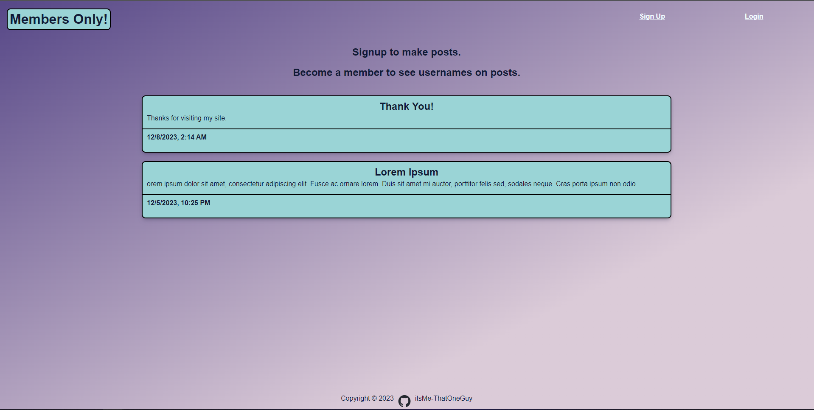

# Members Only



A more advanced public message board allowing users to create an account before posting a message.
Anyone can see a message posted, but only members can see see the username of who posted the message.
Admins can see username of who posted a message, as well as delete any undesirable messages.

**Membership Passphrase** `cats`

## [Live Preview](https://express-members-only.fly.dev/)

Hosted using [Fly.io](https://fly.io/)

### features

- create / read public messages.
- user authentication with passportjs using express-session for persistence.
- user authorization / permissions management.
- secured passwords using bcryptjs.
- membership by entering passphrase.
- database storage via mongodb
- schema validation using mongoose.

## Getting Started

### Environment Variables

You will need your own environment variables to run this app.
Review [.env.example](.env.example) for an example of my .env file.

### Install and Run

```bash
git clone https://github.com/itsMe-ThatOneGuy/express-mini-message-board.git
cd express-mini-message-board
npm install
npm run serverstart
```

## Built With

- [Node.js](https://nodejs.org/en)
- [Express](https://expressjs.com/)
- [Pug](https://pugjs.org/api/getting-started.html)
- [MongoDB](https://www.mongodb.com/)
- [Mongoose](https://mongoosejs.com/docs/)

**Notable Packages**

- [express-passport](https://www.passportjs.org/)
- [express-session](https://www.npmjs.com/package/express-session)
- [rate-limiter-flexible](https://www.npmjs.com/package/rate-limiter-flexible)
- [bcrypt](https://www.npmjs.com/package/bcrypt)

## DEV BLOG

- This project helped me further drive home my knowledge of nodejs, express, and MongoDB fundamentals.
- After starting the project, I realized quickly that the messaging displaying / posting aspects are just like my [Mini Message Board](https://github.com/itsMe-ThatOneGuy/express-mini-message-board) App.
  Knowing that, my main obstacles were going to be allowing user to create an 'account' as well as login / logout.
- I started with setting up passportjs for the authentication. At first my passportjs code was located in the app.js file, but to keep with mvc concepts I moved the code to a separate module file.
  Learning passport, I found out I need to incorporate a session to create the cookie and persist logins over all my routes. For this I am using express-session.
- When I started using express-session, I was just using memory storage. After moving to test for production, I learned that I would need a new session storage since memory storage is not meant for production.
  I decided to use MongoStore for this sense I was already using MongoDB to store user and message modals. After configure the session code, I also moved it to it's own module file.
- I wanted to make sure password were being stored in the DB securely, for this I used bcrypt for password hashing.
- After getting everything working together, I moved on to making my app perform better and be more secure. I fallowed express's topics in there advanced section.
  A big part of security my app was missing was rete limiting. Rate-limiter-flexible was recommended for this, and was my biggest hurdle for completing my app.
- I spent a day trying to implement a login endpoint limiter. I used the package's example as a guideline, learning how the point consumption works.
  The biggest hurdle here was figuring out how to incorporate the rate limiting with my passport code's pre-established password validation using bcrypt.
